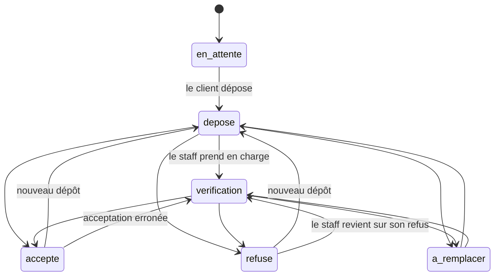
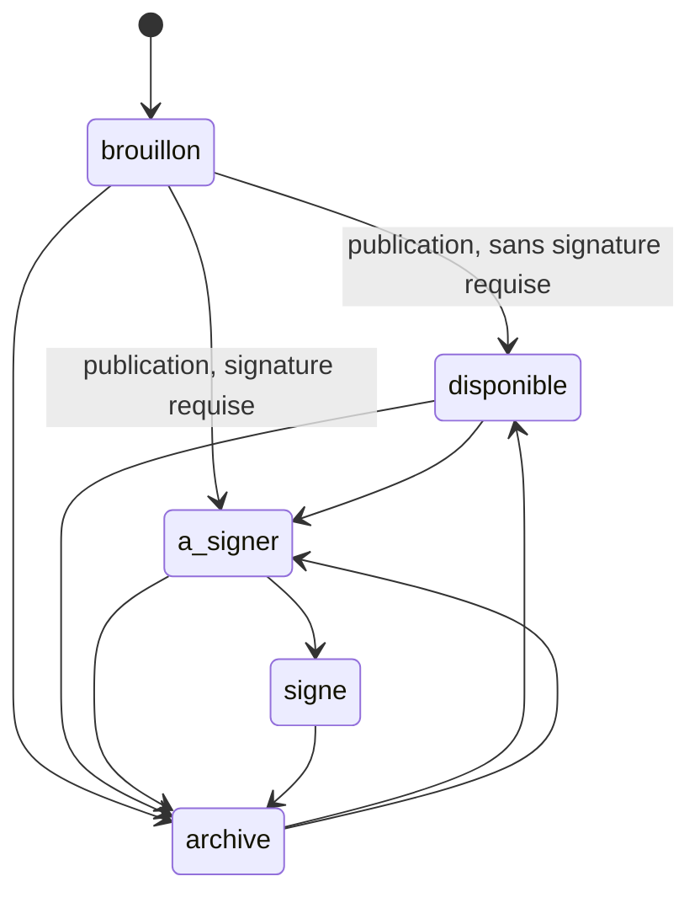
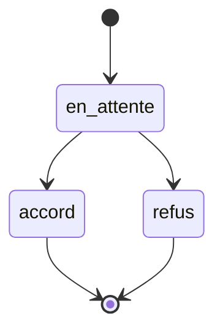
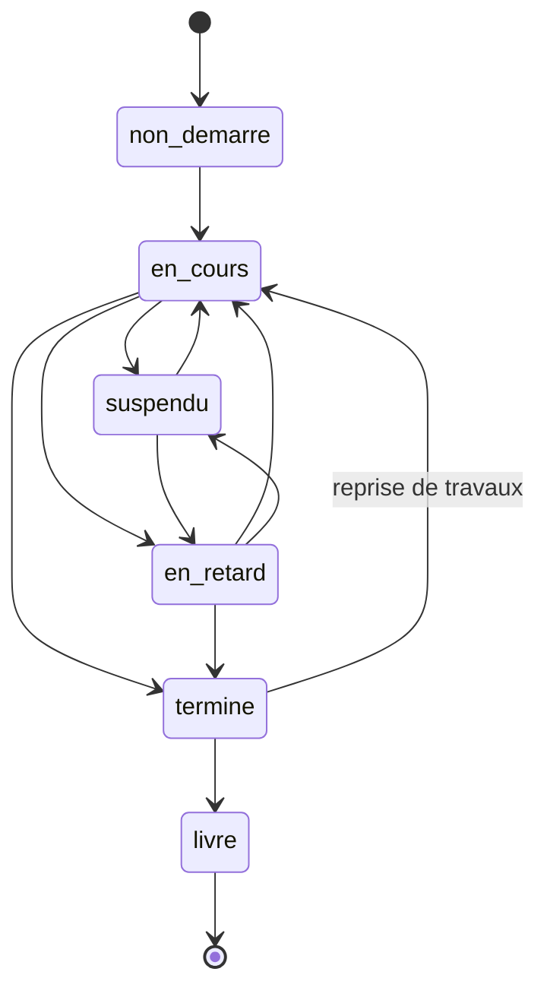

# Statuts et transitions

Chaque statut métier est un enum de `App\Enums`. Les valeurs sont exactement
celles stockées en base et lues par le frontend : les enums ont donné un nom aux
littéraux, ils n'ont rien renommé.

`App\Support\TransitionStatut` fait respecter les transitions et répond **409**
avec la liste des passages possibles. Avant, `Rule::in` validait la valeur sans
jamais regarder d'où l'on venait.

## Pièce justificative — `RequisDocStatut`

Interdit notamment : mettre en vérification ou accepter une pièce **jamais
déposée** ; passer d'un refus à une acceptation **sans réexamen**.

## Document CPI — `CpiDocStatut`

Interdit notamment : signer un **brouillon** — il n'a jamais été transmis au
client, il n'y a rien à signer.

## Orientation bancaire — `BankAssignmentStatut`

Accord et refus sont **terminaux** : ce sont des décisions de l'établissement,
elles ne se révisent pas silencieusement côté CPI. Revenir en arrière suppose de
retirer l'orientation puis de la recréer — geste qui laisse une trace.

## Chantier — `ChantierStatut`

Interdit notamment : sauter de « non démarré » à « livré » ; revenir en arrière
après livraison.

## Parcours du dossier — `Client.dossier_etape`

Ce n'est pas un enum : c'est un entier 0-5 piloté à la main par le personnel via
`POST /staff/clients/{client}/dossier-etape`. Il reste le moteur d'état réel du
parcours, et `Demande` n'a **aucune** colonne de statut propre.

| Étape | Sens | Effet |
|---|---|---|
| 0 | Inscription | — |
| 1 | Demande | — |
| 2 | Pièces | — |
| **3** | **Analyse** | **Verrouille la demande côté client** |
| 4 | Accord bancaire | — |
| 5 | Signature | — |

`Client.statut` est un **texte libre décoratif**, validé nulle part et lu par
aucune logique métier. Ne rien y accrocher.
